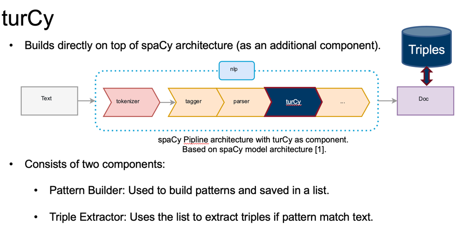
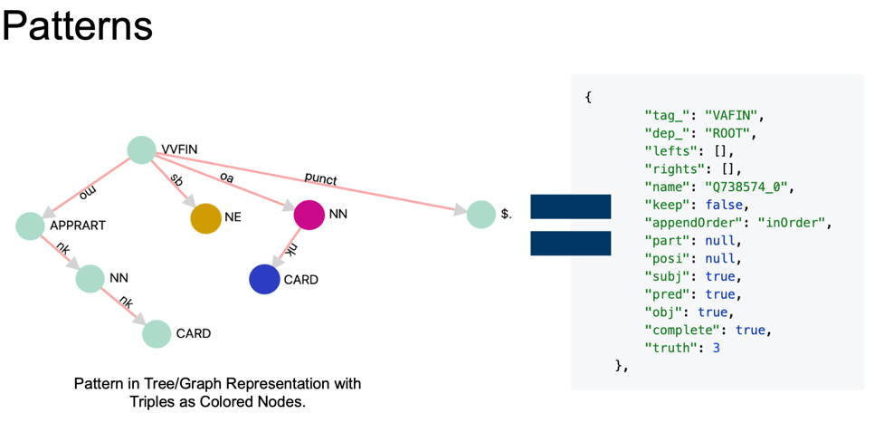
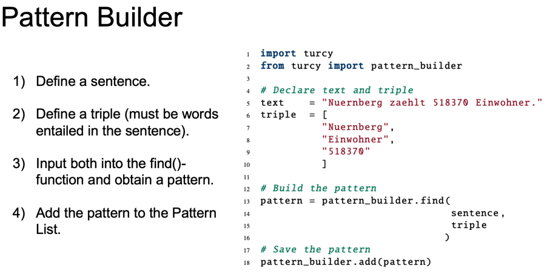
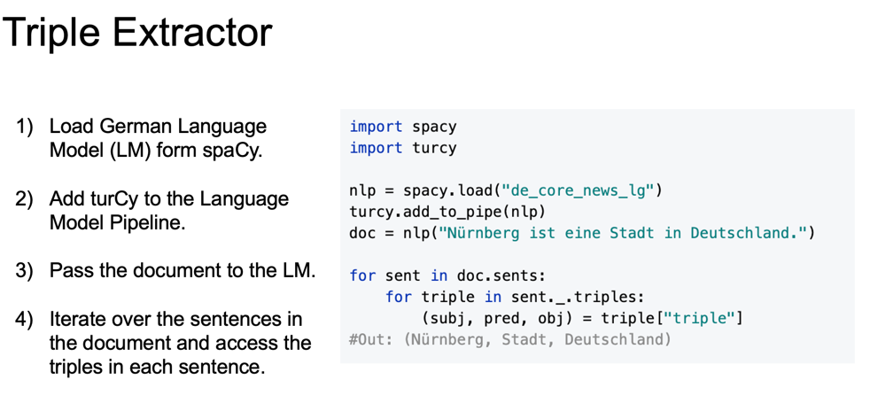
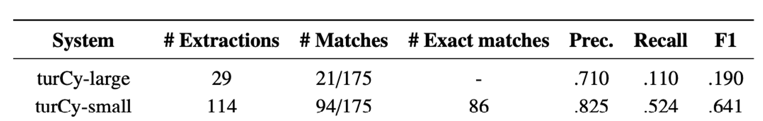
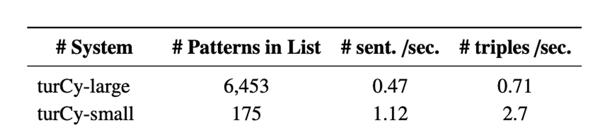

# turCy

An Open Information Extraction System  mainly designed for German.

### Installation
```python
pip install turcy
```

[comment]: <> (### Usage)

[comment]: <> (```python)

[comment]: <> (import spacy)

[comment]: <> (import turcy)

[comment]: <> (nlp = spacy.load&#40;"de_core_news_lg"&#41;)

[comment]: <> (turcy.add_to_pipe&#40;nlp&#41;)

[comment]: <> (pattern_list = "small" # or "large")

[comment]: <> (pipeline_params = {"attach_triple2sentence": {"pattern_list": pattern_list}})

[comment]: <> (doc = nlp&#40;"Nürnberg ist eine Stadt in Deutschland.", component_cfg=pipeline_params&#41;)

[comment]: <> (for sent in doc.sents:)

[comment]: <> (    for triple in sent._.triples:)

[comment]: <> (        &#40;subj, pred, obj&#41; = triple["triple"])

[comment]: <> (#Out: &#40;Nürnberg, Stadt, Deutschland&#41;)

[comment]: <> (```)

Can be applied to other languages as well, however some extrawork is necessary
as no patterns for english are shipped. Therefore, you would have to build your own patterns first.
For building patterns, a `pattern_builder module is available. 

## How it works 



### 1. Building a Pattern 






### 2. Extraction 




### 3. Results 





# References
