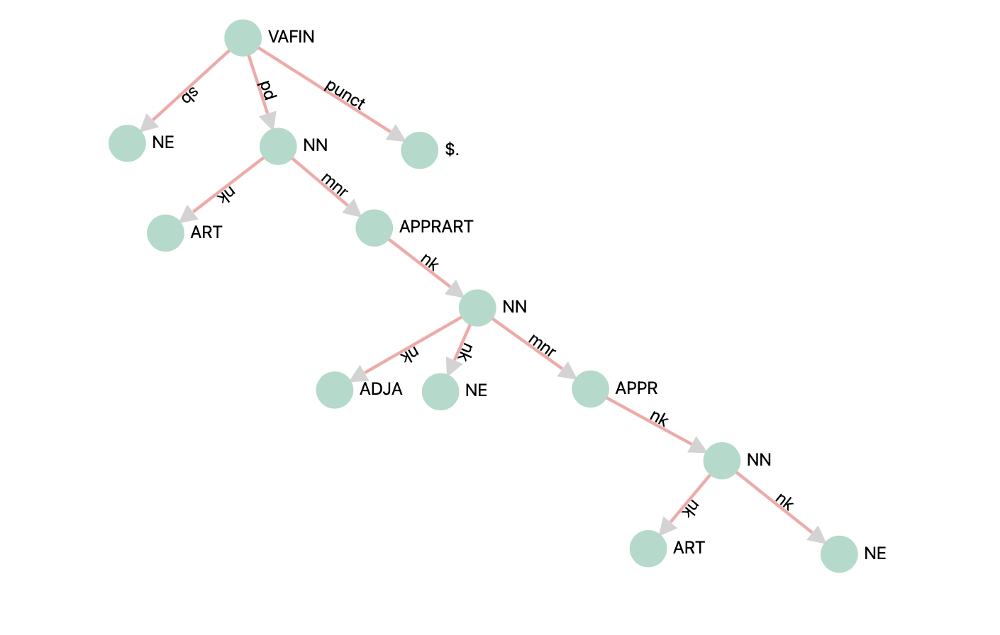

# turCy

An Open Information Extraction System  mainly designed for German.

### Installation
```python
pip install turcy
```
### Usage
```python
import spacy
import turcy

nlp = spacy.load("de_core_news_lg")
turcy.add_to_pipe(nlp)
doc = nlp("Nürnberg ist eine Stadt in Deutschland.")
```

After that, you can access the extarcted triples with:

```python
for sent in doc.sents:
    for triple in sent._.triples:
        (subj, pred, obj) = triple["triple"]
#Out: (Nürnberg, Stadt, Deutschland)
```

Can be applied to other languages as well, however some extrawork is necessary
as no patterns for english are shipped. Therefore, you would have to build your own patterns first.
For building patterns, a `pattern_builder module is available. 

## How it works 

### 1. Building a Pattern 
``
Given the sentence: `Quers ist eine Gemeinde im französischen Département Haute-Saône in der Region Bourgogne-Franche-Comté.` 
a hierarchy (or tree) of words given the dependency parse can be derived.  
The previous shown hierarchy (tree) can be replaced by using a tokens POS-tags as Nodes and the dependencies as relation between tokens. 
The extracted from new tree sentence can be depicted as:



If a triple e.g. 
```
(Quers; Region; Bourgogne-Franche-Comté)
```
is also given, a pattern is created, saving the information where to find the parts (subj, pred, obj) of a triple.
As you may notice, a pattern in the broder sense is a tree esambled of patterns itself. 
Each pattern reflects a Node (POS-tag = tag_) and one relation (if existing, dependency = dep_) and stores information with its successors (lefts, rights).

```json
{
        "tag_": "VAFIN",
        "dep_": "ROOT",
        "lefts": [
            {
                "tag_": "NN",
                "dep_": "sb",
                "lefts": [],
                "rights": [],
                "name": null,
                "keep": true,
                "appendOrder": "inOrder",
                "part": "subj",
                "posi": 0,
                "subj": null,
                "pred": null,
                "obj": null,
                "complete": null,
                "truth": 0
            }
        ],
        "rights": [
            {
                "tag_": "NN",
                "dep_": "pd",
                "lefts": [],
                "rights": [
                    {},
                    {
                        "tag_": "APPR",
                        "dep_": "mnr",
                        "lefts": [],
                        "rights": [
                            {
                                "tag_": "NN",
                                "dep_": "nk",
                                "lefts": [{}],
                                "rights": [
                                    {
                                        "tag_": "NE",
                                        "dep_": "nk",
                                        "lefts": [],
                                        "rights": [],
                                        "name": null,
                                        "keep": true,
                                        "appendOrder": "inOrder",
                                        "part": "obj",
                                        "posi": 0,
                                        "subj": null,
                                        "pred": null,
                                        "obj": null,
                                        "complete": null,
                                        "truth": 0
                                    }
                                ],
                                "name": null,
                                "keep": true,
                                "appendOrder": "inOrder",
                                "part": "pred",
                                "posi": 0,
                                "subj": null,
                                "pred": null,
                                "obj": null,
                                "complete": null,
                                "truth": 0
                            }
                        ], 
                      ...
                    }
                ],
              ...
            },
            {}
        ],
        "name": "Q738574_0",
        "keep": false,
        "appendOrder": "inOrder",
        "part": null,
        "posi": null,
        "subj": true,
        "pred": true,
        "obj": true,
        "complete": true,
        "truth": 3
    },
```

### 2. Extraction 

After a pattern is build, it can be used in the extraction module.
Here, a recursive tree search is performed using the pattern as a base.
Here the pattern attribute "keep" is of crucial importance. 
This stores whether the token is part of a triple. 
In addition the position of a token in the part (Subj, Fred, Obj) is stored to be able to restore the correct reinflight afterwards. 

Since this is the heart of turCy, we encourage you to take a look at the code yourself. 
The reason is that it is much easier to understand the complex operations by reading the code 
than by trying to understand my desperate attempt to put this complexity into words.

# References

